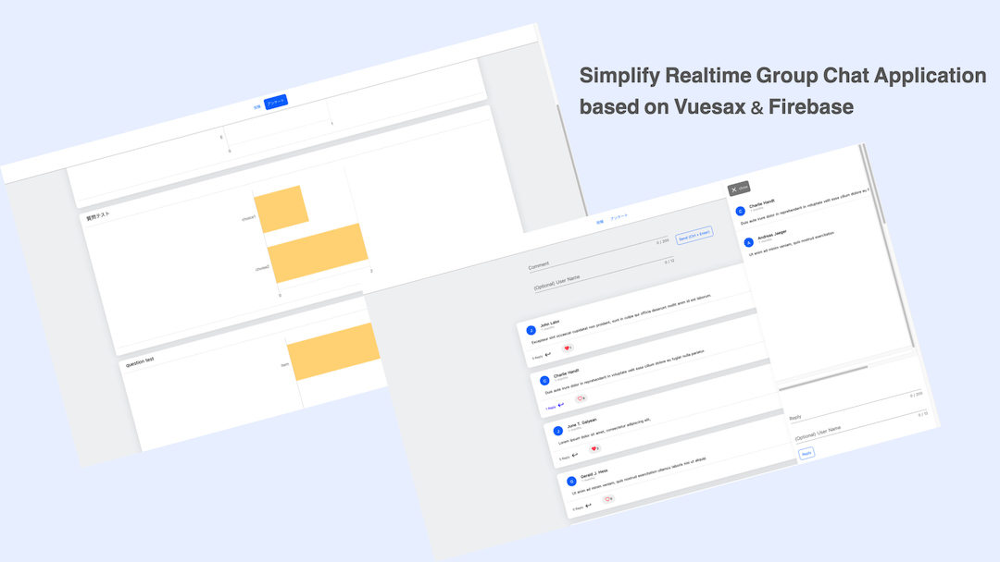

# feedstock



Interactive meeting feedback application 


## Build Setup

```bash
# install dependencies
$ yarn install

# serve with hot reload at localhost:3000
$ yarn dev

# build for production and launch server
$ yarn build
$ yarn start

# generate static project
$ yarn generate
```

For detailed explanation on how things work, check out [Nuxt.js docs](https://nuxtjs.org).

## Deploy with local Docker Container (Nginx)

```bash
$ docker-compose up -d
```

## Deploy with Firebase

In `./plugins/firebase.js`  
Set your Firebase Configuration.

```js
const firebaseConfig = {
    apiKey: "",
    authDomain: "",
    projectId: "",
    storageBucket: "",
    messagingSenderId: "",
    appId: ""
};
```

> Access http://localhost